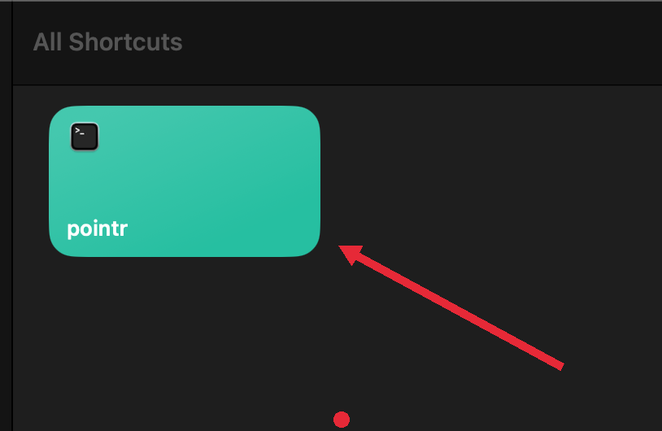
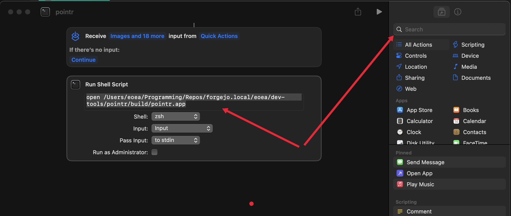
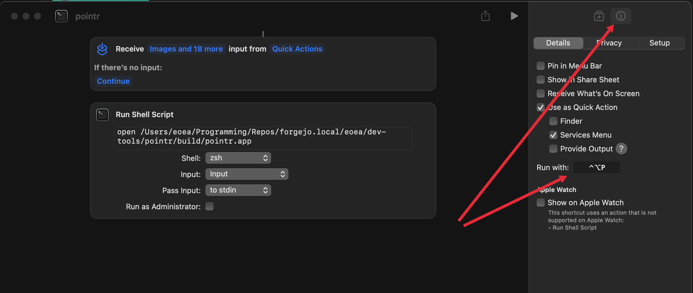

# README

Simple program that allows you to draw arrows on your screen to direct attention
exactly where you want.

The mouse cursor is a colored dot. Hold the **left mouse button** to draw arrows.
Use **Ctrl+Z** to undo and **Ctrl+Y** to redo. Press **Cmd+C** to clear screen. Press **ESC** to
exit. Press **R**, **G**, or **B** to change the color to red, green, or blue.


## Installation

```sh
make prepare
```

```sh
# for mac os bundle
make bundle
```

Binary is saved in build directory. Run:

```sh
./build/pointr
```

Macos app bundle is saved in build directory. Run:

```sh
open ./build/pointr.app
```

## Hotkey

To launch this program with a hotkey use the builtin macos Shortcuts.app and set
it up. Program directory `./build/pointr.app`.

For example: Open **Shortcuts**, create new shortcut, search for terminal type:
`open` and path to your pointr.app file. Set up your hotkey in the Details
panel, mine is set to **Ctrl+option+P**.

Example:







## Remove

```sh
make clean
```
